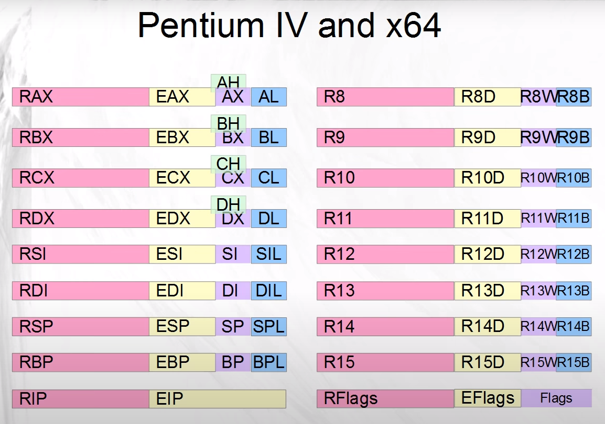

# Registers

## Theory
These are the so-called "general purpose" registers in the x64 architecture:


In x64 (or x86_64) archtecture, the registers have a size of 64 bits or 8 bytes each. As we can see, each register is also divided into smaller parts. Take for example the RAX register, which is a whole 64-bit register. The lower half of RAX is called EAX and it can be treated more or less like a register itself. EAX has 32 bits or 4 bytes. Similarly, the lower half of EAX is AX, a 16-bit register (or 2 bytes). AX is divided into 2 registers: AL (the lower 8-bit register) and AH (the higher 8-bit register).

The lower halfs of the registers on the left side of the picture already existed in the previous 32-bit x86 archtecture. They have been expanded to 64 bits, and moreover, all the other registers on the right side of the picture have been added.

All these registers can be used by us in our assembly code, but we will see later that some of those (like RIP and RFlags) are not really general purpose.

## The Code ([reg1.asm](reg1.asm))
```assembly
global _start

section .text

_start:
    mov rdx, 10
    xchg rax, rdx
    mov rbx, rax
    mov rdi, rbx
    mov rax, 60
    syscall
```
Here we introduce a new instruction: `xchg`. The `xchg` instruction is very simple. It stand for exchange and well... exchanges (or swaps) the registers. For the rest it should be understandable.

## The Code ([reg2.asm](reg1.asm), [main.c](main.c))
```assembly
global asm_func 

section .text

asm_func:
    mov eax, 70000
    mov cx, 7
    mov dx, cx
    mov ax, dx
    ret

section .note.GNU-stack noalloc noexec nowrite progbits
```
Here is what happends:
* `mov eax, 70000`: Puts 70.000 into `eax`. Note that this number cannot be represented as an 16-bit integer, but `eax` is 32-bit.
* `mov cx, 7`: Puts 7 in `cx`
* `mov dx, cx`: Moves the content from cx to dx
* `mov ax, dx`: And now from DX to AX <br>
Now note here that AX is the lower half of EAX, which
previously held a number larger than any 16-bit number.
Since AX is just 16-bit long,
this means that instead of just 7, EAX should have a big
number, with a 7 in its last 16 bits.

## The Code ([reg1.asm](reg1.asm), [main.c](main.c))
```assembly
global asm_func 

section .text

asm_func:
    mov rax, 5000000000
    mov eax, 3
    ret

section .note.GNU-stack noalloc noexec nowrite progbits
```
Here is what happends:
* `mov rax, 5000000000`: Move a very large number (>32-bit) into `rax`
* `mov eax, 3`: Move 3 into `eax`. This time, we can expect the upper half of `rax` to be erased. <br>
The behaviour for mov differs between 32-bit destinations (the registers which are receiving the value) and destinations of other sizes. Any mov to a 32-bit register will erase the higher half of the 64-bit register. But mov to a 16-bit register will not erase the upper half of the 32-bit register that contains it (let alone the half of the 64-bit register).

<br>
The C code is the same as from the last chapter.

## Challenge
This chapter did not contain any "Run" section. Figure out how to run commands work. [**Solution**](SOLUTION.md).
